The Afghan Collection is the first anti-war NFT project on the blockchain and the first collection presented by Osmosis NFT Art. It was inspired by the evacuation of Kabul by Afghans and NATO forces. It is a series of 20 images, symbolizing the 20 years US fought in that region. Each image will be minted 20 times, 19 will be listed with a fixed price and one of them will be auctioned, giving the winner all the commercial rights. The collection is available only here: [OpenSea](https://opensea.io/collection/osmosis-nft-art-the-afghan-collection).

So lets dive into the comics   and the story behind them!

 

###  They Seem Friendly

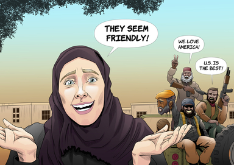{:height="800px" width="600px"}

Who couldn't remember the glorious quote from Clarissa Ward during the CNN news coverage ["They are chanting death to America but they seem friendly at the same time"](https://www.youtube.com/watch?v=96pNUUkHDp4&ab_channel=CruelNibba). Even though Taliban seemed to be friendly with Clarissa, they weren't that friendly with [Fawad Andarabi, an Afghan Folk singer who was shot dead days after](https://www.youtube.com/watch?v=DdPSJvT999s&ab_channel=IndiaToday).

 
### War march
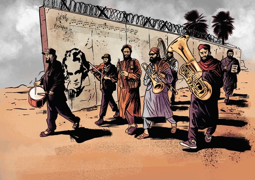
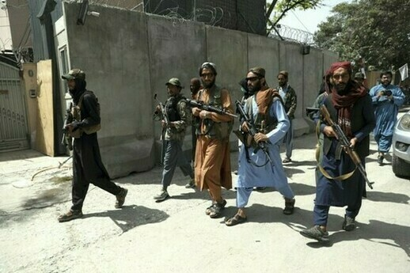

One of the iconic images which were shown in the media, is that of Taliban warriors patrolling Kabul streets with their AK-47 at hand, after having met no resistance. Except one picture, I have decided in my collection to not show guns. Here I replaced their weapons with musical instruments, with a touch of Beethoven and his moonlight partiture. As you might know, Taliban warriors do not allow music or the use of musical instruments.

 
### Honey I am home!
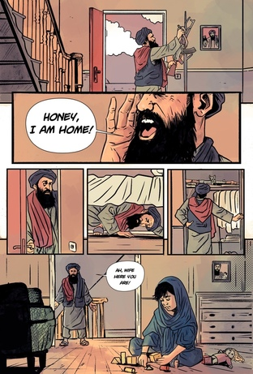

Taliban, consider women to be nothing more than an animal. They have no choice, no voice, everything is predetermined in their life. They use them only for reproductive reasons. Here I depict the brutality young women face since childhood. In the west we are busy pointing fingers to everyone calling them names. People shouting for their rights, average citizen is more fragile than a piece of glass, ignoring the fact that in some parts of the globe you are nothing.  

 
### Graduation class

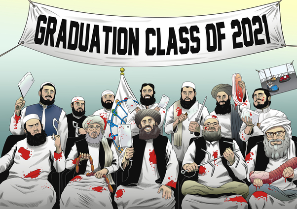 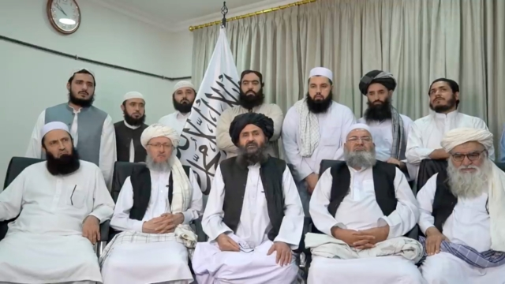

Another legendary photo which was shared in the media was this 'family photo' of the Taliban. In the middle there is their leader. This image was quite boring so I spiced it up a bit. It is surreal how a group who has caused so much pain and suffering in its own land, takes so much pride on their fight.

 
### Exodus

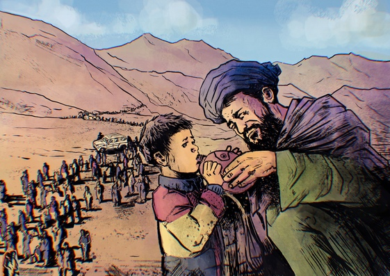 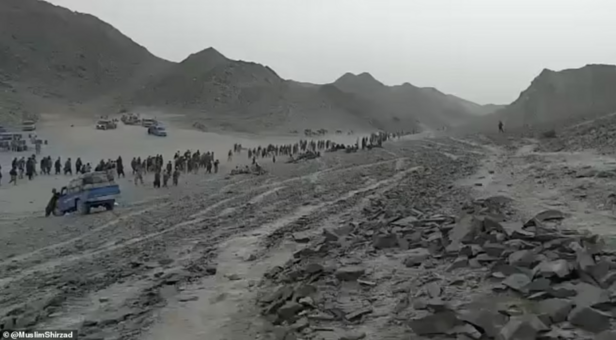

One of the worst things that can happen during war, is for people to flee their country. It is heartbreaking to see convoys leaving to the borders, walking miles under the boiling sun hoping for a better future elsewhere.

 
### For a better future
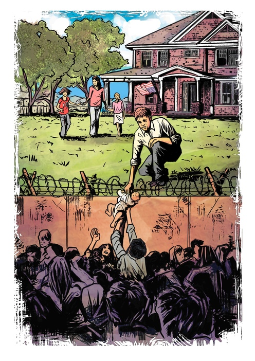 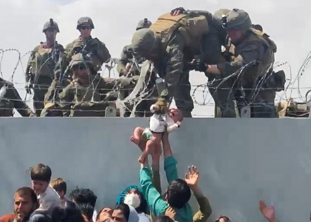

What could be even more heartbreaking from the Exodus, is to see parents giving their child, hoping that it will have a better future in the hands of a stranger. They understand that living hell is inevitable for them, but hopefully their kid will stand a better chance with a new family, in a new land.

 
### For the fallen
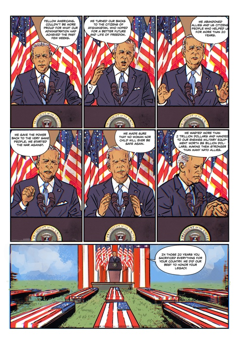

Taking the decision to evacuate a country which cannot stand on its own feet, giving your enemy 80 billion dollars worth of military equipment and spending 2 trillion dollars to bring back the same people you supposedly fought against is an accomplishment. If a manager had taken these actions, he would be fired on the spot. Somehow this guy brags about how well things turned out. On the other hand you have the soldiers who fought and died for their country because they believe in something greater than themselves, the ideals of the flag. I wanted it to look like Biden is testifying in front of the dead and being judged for his and all decisions of previous presidents.

 
### Liberation
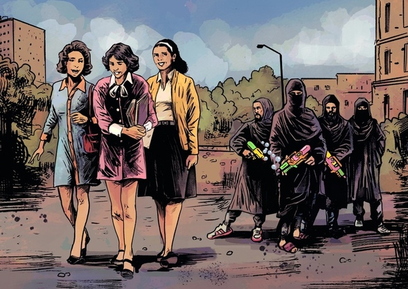 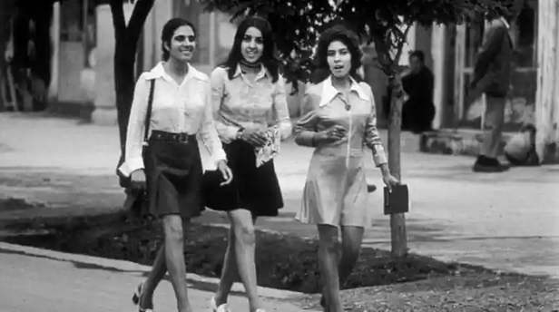

Under sharia law, women should wear hijab and niqab. What if thing worked the other way around? What if women were free to express themselves as they please and Taliban where the ones oppressed instead? On the right picture is shown how women dressed in the 70s prior to the Taliban tyranny.

 
### Swan lake
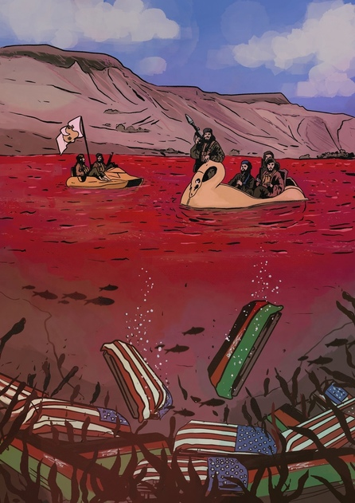 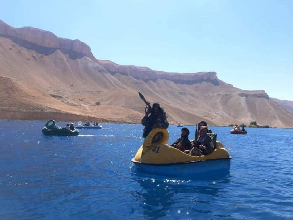

US left wing media decided to depict Taliban as 'playful kids' with a kind soul and not the same monsters they once were. Even if a wolf wears sheep's clothes, he is still a wolf

 
### Drone strike

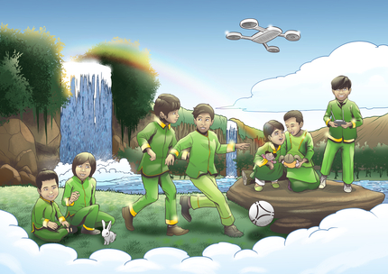 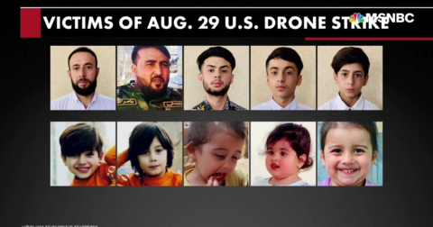

After Isis took responsibility for the explosion in Kabul airport, US wanted a payback. The 'payback' resulted in 10 civilian casualties, [ 7 of which were kids.](https://www.nytimes.com/2021/09/10/world/asia/us-air-strike-drone-kabul-afghanistan-isis.html). No correlation to terrorist organization was found. We tried to depict Jannah, the Islamic paradise, as accurate as possible.
 

### Happy Pinata

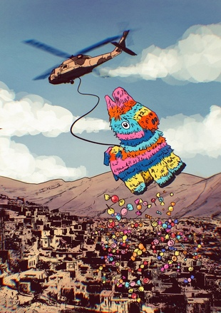 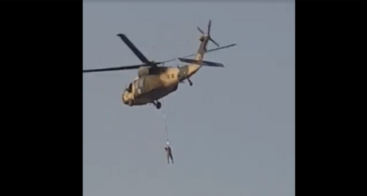

One of the original pictures published to the media was that of a man hanging from a chopper. What was later revealed was that the man was trying to install a flag. Nevertheless the image made an impression.

 

### The Onion
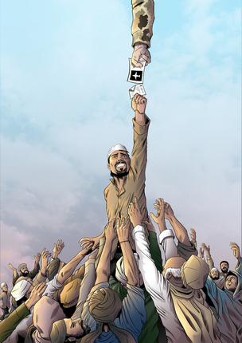

This piece is dedicated to all those who were left behind. Those who were promised a safe life if things turned ugly. Those who were betrayed by the political leadership. Those who were forced to select who will be free and who will stay behind.

 

### Girl with flower

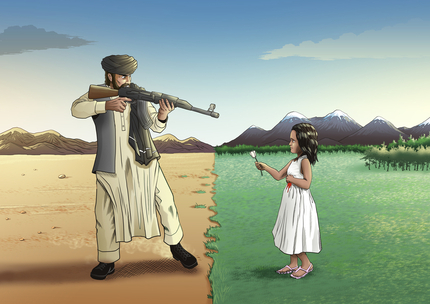

Image speaks for itself

 

### Biden in Heaven
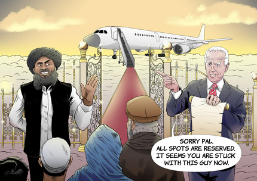

More or less this is how things ended up for the unfortunate ones.

 
### Biden's Justice

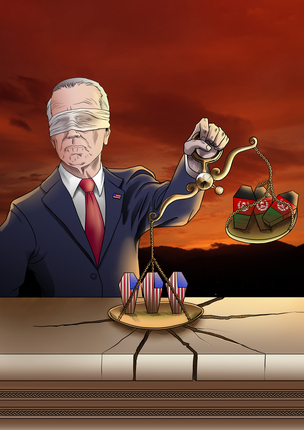

One of the things that I despise in this president is that he always emphasizes the deaths of all the American soldiers and he omits to mention the sacrifice of all the Afghans who fought for the freedom of their country or died tragically as casualties.
 
### Drawing in an alternate reality

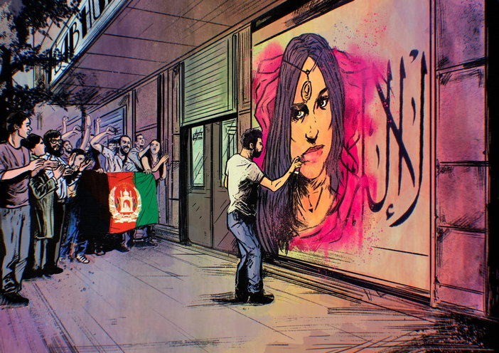 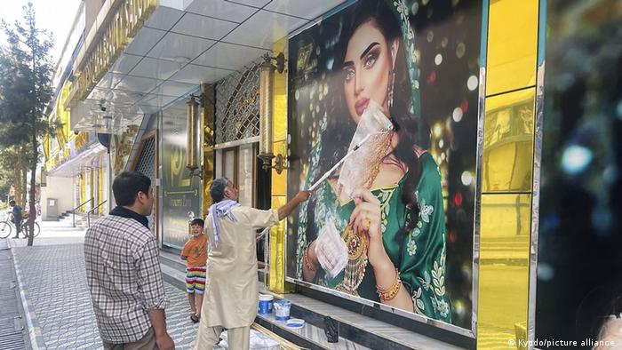

On the right a store owner paints his store front, so that a woman figure is not visible anymore. What if things were polar opposite, what if the Taliban were kicked out of power and people were free to draw a woman figure once again?

 

### Peace studio
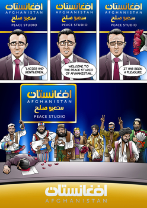 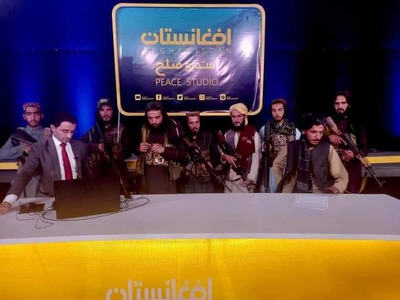

One of the most published scenes in the media was that of the Taliban entering the "Peace Studio" and proclaiming that they will bring peace and liberty to the Afghan people.
